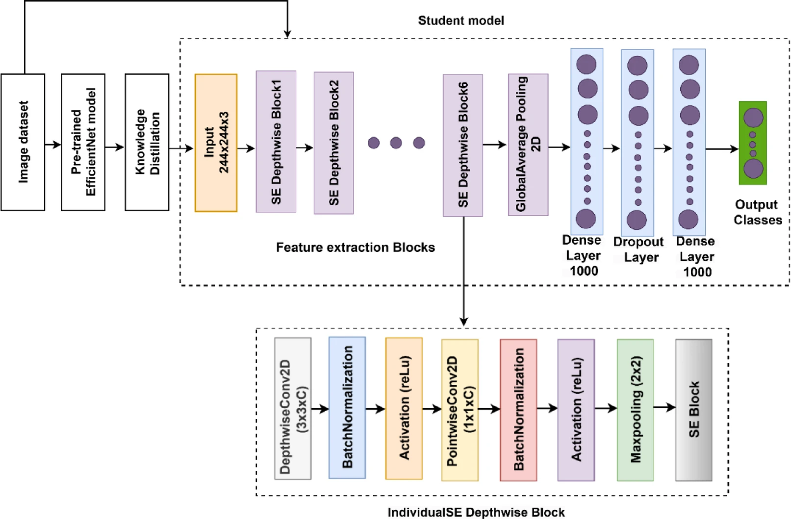

# Is-Plant-Okay 🌱?
## Concept
A solar-powered sensor node that uses a low-power camera and a tiny on-board ML model to detect early signs of plant disease. It will be mounted on a stake and its purpose is to continuously watch the same plant or section of crop bed. 

It will periodically take a picture every 4 hours. When it sees trouble, it will send a compact alert packet over LoRa to a base station. The farmer will receive a notification and can inspect or treat the plant before disease spreads

Dataset to be trained on: https://www.kaggle.com/datasets/vipoooool/new-plant-diseases-dataset

ML model: https://www.nature.com/articles/s41598-025-06452-5

## Hardware
- 🧠 MCU: Arduino Nano 33 BLE Sense Rev2 
- 🔋 Lipo: 3.7 2000mAh
- ☀️ Solar power cells: 0.5W Solar Panel 55x70
- 📷 Camera: Himax CMOS imaging camera (HM0360-MWA-00FP963)
- 🌡️ Temperature sensor: Arduino Nano 33 BLE Sense Rev2 (onboard HS3003)
- 🌡️ Humidity sensor: Arduino Nano 33 BLE Sense Rev2 (onboard HS3003)
- ~~🌡️ Soil moisture sensor: (Premi um option: RS485)~~
- 🖵 Screen: 0.96 inch OLED 
- 📡 LoRa: SX1278 RA-02 (Premium option:RYLR998)

## Software
- KiCad 9.0: Schematic diagram drawing & PCB design
- Fusion 360: Case design

# BOM:
| Hardware | Price ($USD) | Link |
| :------: | :---: | :--: |
| Arduino Nano 33 BLE Sense Rev 2 | 24.10 | https://www.digikey.com.au/en/products/detail/arduino/ABX00072/22478341?gclsrc=aw.ds&gad_source=1&gad_campaignid=22234799474&gbraid=0AAAAADrbLli1mxSf0QBCTxaTjv1b-k3Pd&gclid=CjwKCAjwuePGBhBZEiwAIGCVSy8whzDUQ_wo1qGUCEm0Dx-AgmW5Zc68ZqZuL7PP94tv6sZ8y9AFChoCTpcQAvD_BwE
| 0.5W Solar Panel 55x70 | 6.07 | https://www.digikey.com.au/en/products/detail/seeed-technology-co-ltd/313070004/5488049?gad_source=1&gad_campaignid=22258692864&gbraid=0AAAAADrbLlhlBg2sAgWDGFOENqgOK8itr&gclid=CjwKCAjwuePGBhBZEiwAIGCVS1SN-ztdDNMpsNeNdLkv1kFB5a2T7XsfMUYFsP6d9YNnIU8SkSqs2BoCFH4QAvD_BwE&gclsrc=aw.ds
| HM0360-MWA-00FP963 | 21.90 | https://www.digikey.com.au/en/products/detail/himax/HM0360-MWA-00FP963/14109819?gclsrc=aw.ds&gad_source=1&gad_campaignid=17413568847&gbraid=0AAAAADrbLlgyMTv95JMcJ6yXuerrPbv47&gclid=CjwKCAjwuePGBhBZEiwAIGCVS2BsgGUcC6Mo7IUe90jY_B7H7qjMXdXwqIchrUhshmXNRlemCx0_sxoCaBcQAvD_BwE
| 1.5 OLED RGB | 56.41| https://www.digikey.com.au/en/products/detail/newhaven-display-intl/NHD-1-5-128128ASC3/5788624?srsltid=AfmBOop7KIW_z4-CxohpvjG2sp7hZlhfLxDBvmxYbbApqQR8q-u4zEVF
| RA-08H-915 | 8.57 | https://www.digikey.com.au/en/products/detail/ai-thinker/RA-08H-915/16707735?gad_source=1&gad_campaignid=22639496806&gbraid=0AAAAADrbLlhmY8xnCCqB41RYChARVbrWO&gclid=CjwKCAjwuePGBhBZEiwAIGCVS5VgTjF6Pva9VdO0K95FJU2QNHNCBSVff3Mbs73edDpxMqlk5Dqt8hoC8MUQAvD_BwE&gclsrc=aw.ds

## Inspiration
https://core-electronics.com.au/solar-lipo-charger-3-7v.html?gad_source=1&gad_campaignid=17417005429&gbraid=0AAAAADlEpP5hdt5SrEQd7QDKWpbK3QQSB&gclid=EAIaIQobChMI1JaFiPXgjwMVgyN7Bx0SeB8vEAQYASABEgJKWPD_BwE

## Model layout
The model that will be used is based of the paper: [AI and IoT-powered edge device optimized for crop pest and disease detection](https://www.nature.com/articles/s41598-025-06452-5). It is called Tiny-LiteNet, and it uses a pretrained MobileNetv2 model as a teacher model. Tiny-LiteNet utilises six squeeze-and-excitation (SE) depthwise blocks to enhance feature representation, reduce compute cost and improve accuracy combined. The size of this model is 1.2Mb.

Tiny-LiteNet architecture:
