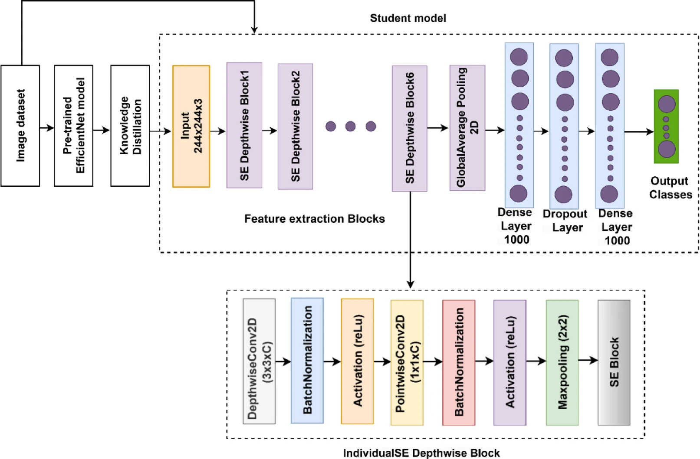

# Is-Plant-Okay 🌱?
## Concept
A solar-powered sensor node that uses a low-power camera and a tiny on-board ML model to detect early signs of plant disease. It will be mounted on a stake and its purpose is to continuously watch the same plant or section of crop bed. 

It will periodically take a picture every 4 hours. When it sees trouble, it will send a compact alert packet over LoRa to a base station. The farmer will receive a notification and can inspect or treat the plant before disease spreads

Dataset to be trained on: https://www.kaggle.com/datasets/vipoooool/new-plant-diseases-dataset

ML model: https://www.nature.com/articles/s41598-025-06452-5

## Hardware
- 🧠 MCU: Arduino Nano 33 BLE Sense Rev2 
- 🔋 Lipo: 7.4 2000mAh
- ☀️ Solar power cells: 0.5W Solar Panel 55x70
- 📷 Camera: Himax CMOS imaging camera (HM0360-MWA-00FP963)
- 🌡️ Temperature sensor: Arduino Nano 33 BLE Sense Rev2 (onboard HS3003)
- 🌡️ Humidity sensor: Arduino Nano 33 BLE Sense Rev2 (onboard HS3003)
- ~~🌡️ Soil moisture sensor: (Premi um option: RS485)~~
- 🖵 Screen: NHD-1.5-128128ASC3 1.5 inch OLED 
- 📡 LoRa: SX1278 RA-02 (Premium option:RYLR998)
- ~~💡 Light Sensor: TSL2591~~
- ~~⚡ UV Sensor: VEML6075~~

## Software
- KiCad 9.0: Schematic diagram drawing & PCB design
- Fusion 360: Case design

# BOM:
| Hardware | Price ($USD) | QTY| Link |
| :------: | :---: | :--: | :--: |
| Arduino Nano 33 BLE Sense Rev 2 | 38.70 | 1 | https://www.digikey.com.au/en/products/detail/arduino/ABX00069/16891607?s=N4IgTCBcDaIIICEAaAGNA2AnCAugXyA
| 0.5W Solar Panel 55x70 | 6.07 | 2 | https://www.digikey.com.au/en/products/detail/seeed-technology-co-ltd/313070004/5488049?gad_source=1&gad_campaignid=22258692864&gbraid=0AAAAADrbLlhlBg2sAgWDGFOENqgOK8itr&gclid=CjwKCAjwuePGBhBZEiwAIGCVS1SN-ztdDNMpsNeNdLkv1kFB5a2T7XsfMUYFsP6d9YNnIU8SkSqs2BoCFH4QAvD_BwE&gclsrc=aw.ds
| CAMERA-OV7670 | 10.25 | 1 | https://www.digikey.com.au/en/products/detail/olimex-ltd/CAMERA-OV7670/21662189?gad_source=1&gad_campaignid=22258692864&gbraid=0AAAAADrbLlj6oJtUsNfVx1vIrDFE3BPZ1&gclid=Cj0KCQjw9JLHBhC-ARIsAK4PhcpgwkVmjjOCHtvELpGt-0733CaYN9VAK-Vob_rOJUDzvEmz226i8pQaAqYBEALw_wcB&gclsrc=aw.ds
| (Camera Alternative) Mini 2MP SPI Camera Module | 25.99 | 1 | https://core-electronics.com.au/mini-2mp-spi-camera-module-for-raspberry-pi-pico.html
| GRAPHIC DISPLAY TFT RGB 0.96" | 12.65| 1 | https://www.digikey.com.au/en/products/detail/adafruit-industries-llc/3533/7386265?_gl=1*b8bl6n*_up*MQ..*_gs*MQ..&gclid=Cj0KCQjw0Y3HBhCxARIsAN7931UClWFcKTlh2fkHoq46prUC8q0JHHVEXAIprqbeCdMH-Q-fxAHX3awaAoXnEALw_wcB&gclsrc=aw.ds&gbraid=0AAAAADrbLlg15LkEfC3epRZwz2bj5q-3L
| LORA BREAKOUT BOARD WITH ANTENNA (SX1278) | 4.12 | 2 |https://www.digikey.com.au/en/products/detail/ai-thinker/RA-01S-KIT/16688834?gad_source=1&gad_campaignid=22326148211&gbraid=0AAAAADrbLlhLN5hmf02vxdAPvPhM4dgSv&gclid=Cj0KCQjw9JLHBhC-ARIsAK4PhcreZk6yLUpkKNMcTffMBGgSn7cPre5FqczhVUk0twJjBSD5UAG_9JgaAqmoEALw_wcB&gclsrc=aw.ds
| (Lora alternative) WIO-E5 MINI DEV BRD STM32WLE5JC | 21.90 | 1 | https://www.digikey.com.au/en/products/detail/seeed-technology-co-ltd/113990939/13926228
| 18650 BATTERY PROTECTION MODULE | 3.9 | 1 | https://www.digikey.com.au/en/products/detail/dfrobot/FIT0869/15997370?gad_source=1&gad_campaignid=22258692864&gbraid=0AAAAADrbLlg15LkEfC3epRZwz2bj5q-3L&gclid=Cj0KCQjw9JLHBhC-ARIsAK4PhcrrSuu6PmTF7blXYFuWj3jp-5aErfmPy3v33kaB2AZqo8hcHLbKMqoaAtIpEALw_wcB&gclsrc=aw.ds
| BATT HOLDER 18650 2 CELL PC PIN | 5.16 | 1 | https://www.digikey.com.au/en/products/detail/mpd-memory-protection-devices/BK-18650-PC4/2330513
| SPI RTC | 27.5 | 1 | https://www.digikey.com.au/en/products/detail/sparkfun-electronics/10160/5318743?gad_source=1&gad_campaignid=17413568847&gbraid=0AAAAADrbLlhQzfR05Cs2nWnXQWMDkBFCG&gclid=Cj0KCQjwl5jHBhDHARIsAB0YqjxafYtF9_N9fzqCNYOEMk2vtOCLYpYshzIofeoXUn1t9SEJgBJjOhwaAnBeEALw_wcB&gclsrc=aw.ds

## Inspiration
https://blog.arduino.cc/2020/06/24/machine-vision-with-low-cost-camera-modules/
https://cdn-learn.adafruit.com/downloads/pdf/adafruit-mini-tft-0-dot-96-inch-180x60-breakout.pdf
https://files.seeedstudio.com/products/317990687/res/LoRa-E5%20module%20datasheet_V1.0.pdf

## Model layout
The model that will be used is based of the paper: [AI and IoT-powered edge device optimized for crop pest and disease detection](https://www.nature.com/articles/s41598-025-06452-5). It is called Tiny-LiteNet, and it uses a pretrained MobileNetv2 model as a teacher model. Tiny-LiteNet utilises six squeeze-and-excitation (SE) depthwise blocks to enhance feature representation, reduce compute cost and improve accuracy combined. The size of this model is 1.2Mb.

Tiny-LiteNet architecture:
